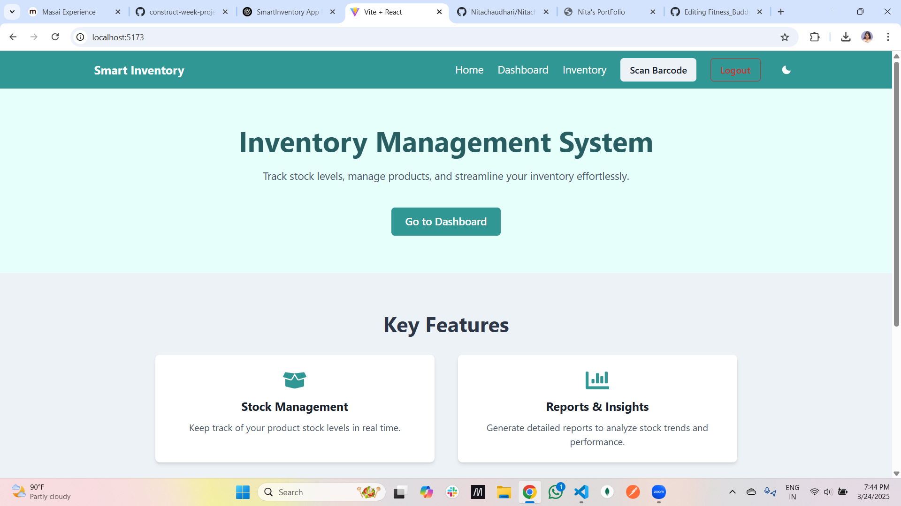
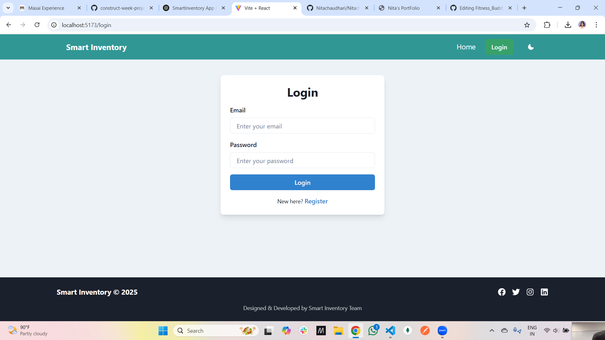
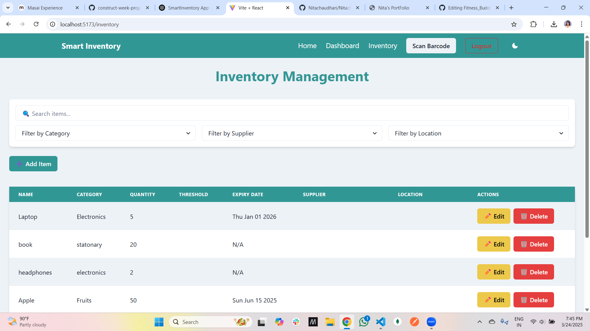
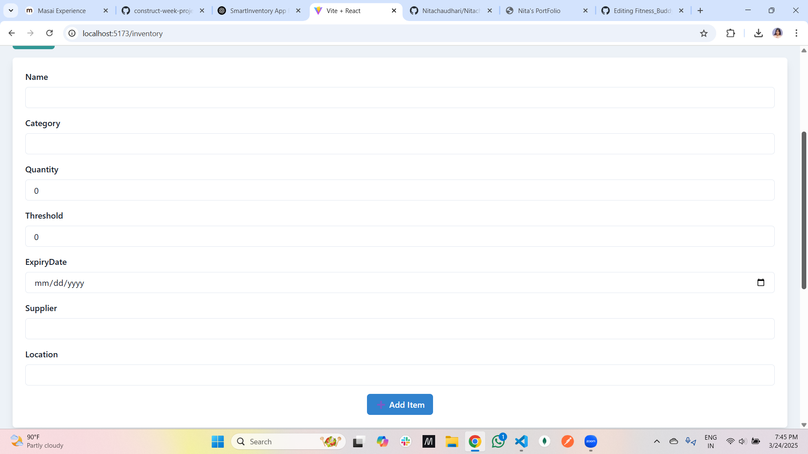
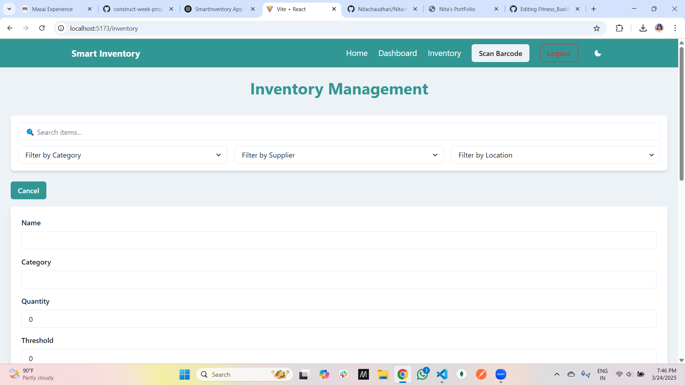

# 📦 Smart Inventory System

**A comprehensive inventory management system to efficiently track, manage, and optimize stock levels. Smart Inventory helps businesses streamline inventory processes, monitor stock movement, and prevent overstocking or shortages.**

---

## 🚀 Features
- 🔑 **Authentication** - Secure user login & profile management
- 📊 **Inventory Tracking** - Monitor stock levels and prevent shortages
- 🔍 **Advanced Search & Filtering** - Quickly find items based on categories, suppliers, or locations
- 📅 **Expiry Date Management** - Track product expiry to avoid waste
- 📍 **Supplier & Location Management** - Organize stock based on supplier and warehouse location
- 📈 **Stock Threshold Alerts** - Receive notifications for low-stock items

---

## 🛠️ Tech Stack
              

---

## Project Type
Frontend | Fullstack

## Deployed App
Frontend: [Smart Inventory](https://smart-inventory.netlify.app/)
backend: [Smart Inventory](https://smart-inventory.netlify.app/)
database:

## Video Walkthrough of the Project
- 📹 [Project Demo](https://youtu.be/example1)

## Video Walkthrough of the Codebase
- 📹 [Codebase Overview](https://youtu.be/example2)

---

## 📸 Project Screenshots  







---

## 📂 Folder Structure
```
Smart_Inventory/ 
│── src/ 
| ├── Assets/ 
│ ├── components/ # Reusable UI components 
│ ├── Pages/ # App pages (Dashboard, Inventory, Reports, etc.) 
│ ├── context/ # Global state management 
│ ├── services/ # API functions (Backend integration) 
│ ├── assets/ # Images & icons 
│ ├── App.jsx # Main app component 
│ ├── main.jsx # Entry point 
│ ├── theme.js # Theme settings 
│── backend/ # Express.js API & database setup 
│── public/ # Static assets 
│── package.json # Dependencies & scripts 
│── README.md # Project documentation
```

---

## 📢 Connect with Me
- **Nita Chaudhury** [](https://www.linkedin.com/in/nita-chaudhari-a94038128/)  
---

## 🚀 Getting Started

### 1️⃣ Clone the Repository
```bash
git clone https://github.com/Nitachaudhari/Smart_Inventory.git
cd Smart_Inventory
2️⃣ Install Dependencies
bash
npm install
npm i @chakra-ui/react@2 @emotion/react @emotion/styled framer-motion
npm i firebase
npm i react-icons
npm i lucide-react
npm install react-router-dom
npm install recharts
npm install express mongoose cors dotenv
npm install html2canvas
npm install jspdf

3️⃣ Set Up Firebase
Create a Firebase project

Add your Firebase config in src/services/firebaseConfig.js

4️⃣ Set Up Backend (MongoDB & Express)
bash
cd backend
npm install
node server.js
5️⃣ Run the App
bash
npm run dev
🎉 Enjoy seamless inventory management with Smart Inventory! 📦💡
